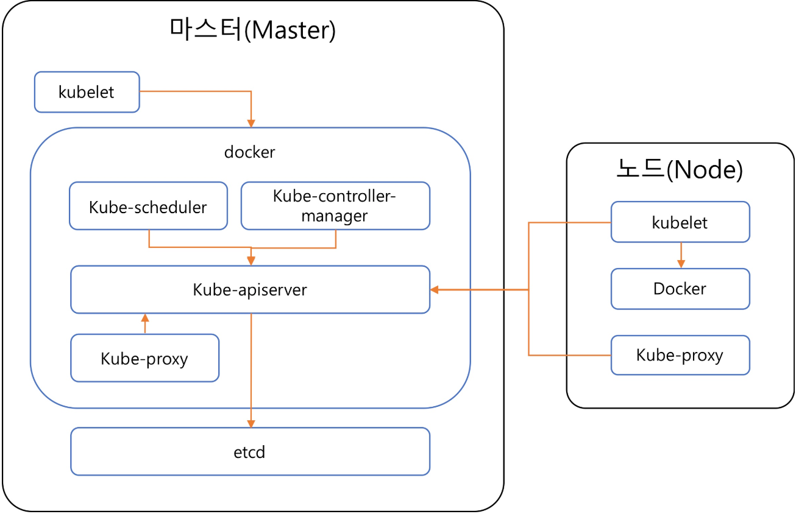

# 쿠버네티스

> 구글에서 만들었다.
>
> 컨테이너를 배포하고 관리해주는 도구
>
> Pet - 한땀한땀 케어를 해주는, 서버 1대 별로 주의관리를 하였음(옛날에)
>
> Cattle - 점으로 보임 언덕의 소 100마리를 한번에 관리하듯이, 

- 쿠버네티스란 컨테이너를 쉽고 빠르게 배포/확장하고 관리를 자동화해주는 오픈소스 플랫폼
  1. kubernetes 이며 줄여서 'k8s' 또는 'kube' 라고도 함
  2. 단순한 컨테이너 플랫폼이 아닌 마이크로서비스, 클라우드 플랫폼을 지향하고 컨테이너로 이루어진 것들을 손쉽게 담고 관리할 수 있는 그릇 역할 을 함
  3. 서버리스, CI/CD, 머신러닝 등 다양한 기능이 쿠버네티스 플랫폼 위에서 동작 가능
- 쿠버네티스 동작방식
  1. 중앙(master)노드와 서버(worker)노드로 나뉘며 중앙노드가 서버노드를 전체적으로 관리
- 쿠버네티스 단점?
  1. 복잡하고 어렵다.
  2. yaml 설정파일이 많고 클러스터 만드는 것 또한 어려움
  3. helm 패키지 매니저를 사용하여 설정파일 관리해야 함

- 가동중지 시간이 없는지 확인
- 다운되면 다른 컨테이너 다시 시작
- 분산 시스템을 탄력적으로 실행
- APP의 확장과 장애 조치
- 배포 패턴 제공(카나리아 배포, 카나리아는 유독가스에 예민해서 수초내로 죽음, 그만큼 유독가스 감지기 역할을 수행으로 기원)

## 솔루션, K8s는 Paas가 아니다

- 지원하는 APP의 유형을 제약하지 않는다.

- 소스 코드를 배포하지 않고 APP을 빌드하지 않는다.

- 어플리케이션 레벨의 서비스를 제공하지 않음(MQ,Spark,Mysql)

- 로깅, 모니터링 또는 경보 솔루션을 포함하지 않는다.

  

1. Iaas
   - 인프라 , ec2, 가상머신
2. Paas
   - 개발(소스 저장소..) -> 배포(배포 관리하는 젠키스 등) -> 운영(모니터링 툴) 에 필요한 서비스를 모두 제공
   - API 연동용으로 많이 씀, 
3. Saas
   - 최종 서비스(웹APP 등)를 사용하는 것
   - dropbox, 

## 아키텍쳐

> 출처: https://arisu1000.tistory.com/27827?category=787056

내결함성

고가용성

실무에서는 master와 worker(노드)를 나누어 쓴다.

리버스 프록시(HA 프록시, nginx) - 외부에서 내부로 트래픽 전달할떄 

### 기능

1. 서비스 디스커버리와 부하분산
2. 스토리지 오케스트레이션
   - 각 스토리지가 100기가 3개면 총 300기가 쓸 수 있도록
3. 자동화된 롤아웃과 롤백
4. 자동화된 빈 패킹(bin packing)
   - 비어있는 걸 채워넣는것?
5. 자동화된 복구(self-healing)
6. 시크릿과 구성관리

## roll out

- 문제가 발생하는지 안하는지 테스트할 수 있는 기능 제공

## roll back

- 적용후 문제 발생시 roll back 기능 제공

## 데몬

서비스관점에서 얘기하면, 백그라운드에서 제공하는 서비스?

자바에서는 쓰레드가 있다.

## Pod

- K8s 어플리케이션의 기본 실행 단위

## 서비스

L4 L7 같이 트래픽을 받아주는 서비스

## 레플리카 셋

CI/CD

state less/ full

state less - 상태정보가 없는?

L4 와 L7 의 차이

L4 tcp를 보고 

L7 은 어플리케이션을 보고 